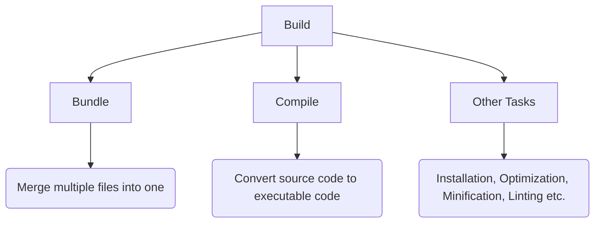
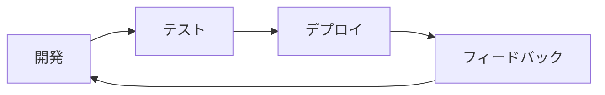
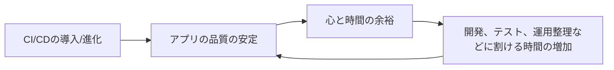
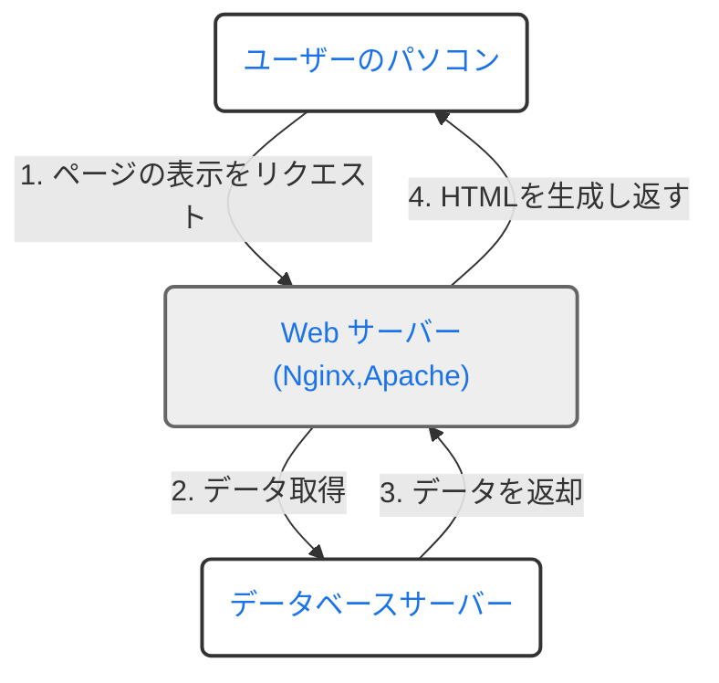
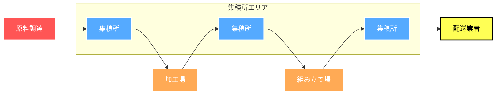
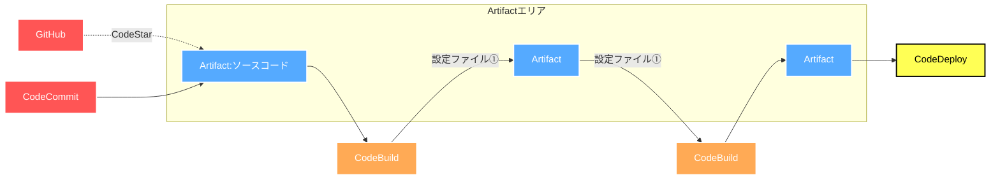
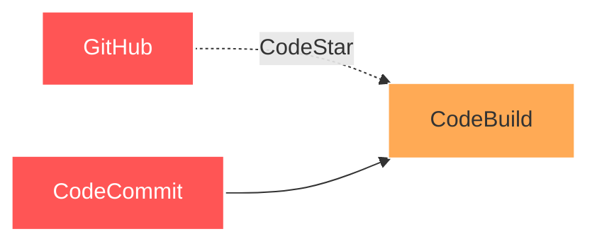
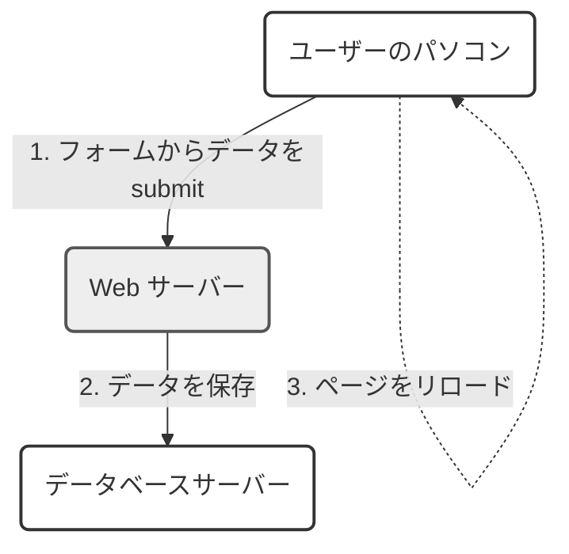
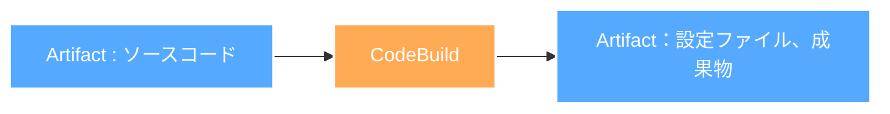

<<<<<<< HEAD
# 中村勉強会　<br>〜AWSインフラ編〜 <br> Codeサービス系 
# #2 組み立て工場見学!ざっくりとパイプラインを外観する
=======
# 〜我々になぜRemix💽が<br>必要なのか Part1〜
## 中村友多朗
>>>>>>> 7b08688fc487c00cf57978b11b26eb5e2289d804

---
transition: fade-out
---
<<<<<<< HEAD

# この勉強会の目標

<br>
<h2>・CodePipelineがどのようにしてCI/CDフローを形成するかを理解する</h2>
<br>
<h2>・CodePipelineの主要概念を理解する</h2>
<br>
<h2>・マネコン/CDKでの実装方法を理解する</h2>

<style>
h1 {
  fontsize: 20px;
  background-color: #2B90B6;
  background-image: linear-gradient(45deg, #4EC5D4 10%, #146b8c 20%);
  background-size: 100%;
  -webkit-background-clip: text;
  -moz-background-clip: text;
  -webkit-text-fill-color: transparent;
  -moz-text-fill-color: transparent;
}

</style>
=======
<h1 class="section-title">この勉強会の目標</h1>
<h3>以下を理解したい</h3>
<br>

<h2>・Webフロントエンドの簡単な変遷とSPAが抱えてきた課題</h2>
<br>
<h2>・PESPAアーキテクチャの観点から見たRemix💽の優れた思想</h2>
<br>
<h2>・Remix💽の将来性</h2>
>>>>>>> 7b08688fc487c00cf57978b11b26eb5e2289d804

---
transition: fade-out
---
<<<<<<< HEAD

# 本日のお題目

## 0. 軽く前回のおさらい
<br>

## 1. CodePipelineの役割
<br>

## 2. 工場見学①原料調達
<br>

## 3. 工場見学②加工場
<br>

## 4. CodePipelineの主要概念
=======
<h1 class="section-title">本日(と多分次回)のお題目</h1>

<style scoped>
h2 {
  margin-bottom: 20px; /* タイトル間のスペースを調整 */
}
ul {
  margin-top: 20px; /* リストの上のスペースを調整 */
}
</style>

<h2 >1. Webにおける通信技術とReact周りの簡単な歴史</h2>
<h2 >2. SPAの登場とそれがもたらした新たな課題</h2>
<h2 >3.プログレッシブエンハンスメントという思想とRemix💽</h2>
<h2 >
4. DjangoとRemix💽の違い

</h2>

- アーキテクチャ
- ルーティング

<<<<<<<< HEAD:archives/code_service2/slides.md
## 4. 工場見学③配送業者
<br>

## 5. CodePipelineの主要概念
<br>

## 6.主要概念を反映したCDKコード
>>>>>>> 7b08688fc487c00cf57978b11b26eb5e2289d804
---
transition: fade-out
layout: center
class: text-center
---
<<<<<<< HEAD

<h1>0.前回のおさらい</h1>
=======
========
<h2 >5.なぜNext.jsではなくRemixを選ぶのか</h2>
<h2 >6.Remix💽の将来性</h2>
>>>>>>>> 7b08688fc487c00cf57978b11b26eb5e2289d804:slides.md

>>>>>>> 7b08688fc487c00cf57978b11b26eb5e2289d804


---
transition: fade-out
<<<<<<< HEAD
---

# CI/CDとは？

<br>

## ①CI(Continuous Integration)
→ コードの変更を<span style="color: red;">継続的に</span>統合する過程(ビルド、テスト)



<br>

## ②CD(Continuous Deployment/Delivery)
→ 統合されたコードを実環境に<span style="color: red;">継続的に</span>反映させる過程(デプロイ)

---
transition: fade-out
---

# 高速なフィードバックループの実現

<div grid="~ cols-2 gap-3" style="margin-bottom: 100px;">
<div>

<br>


</div>
<div>

## ①アプリケーションの品質安定

<br>

## ②手動運用時に起こりうるヒューマンエラーの削減


</div>
</div>

### だけではなく...


---
transition: fade-out
---

# もう一つの幸せスパイラル

<br>


<div grid="~ cols-2 gap-3">


</div>

---
transition: fade-out
---

# 実はCI/CDツールはたくさんある
## →CircleCI,Jenkins,GitLab,GitHub Actions, Azure,GCP系サービス


## 結論:AWSのサービス群を選択

<br>

## 1.信頼と実績

### ・すでにプロトが用意してあって、最低限のCI構築はできていた
### ・CodeDeployだけ一応使ったことがあった
<br>

=======
layout: center
---

## 1.Webにおける通信技術とフロントエンド周りの簡単な歴史


---
transition: fade-out
layout: two-cols-header
---

<h2 class="normal-section-title">Webにおける動的なアプリケーションの起源</h2>


::left::

## CGI(Common Gateway Interface)方式
<br>
<ul>
<li v-click>Webサーバーが別の言語に処理を委譲して動的にHTMLを生成する仕組み</li>
<li v-click>ページ表示のリクエストに対して、データベースに保存されているデータを動的に埋め込んだHTMLをレスポンスとして返却</li>
<li v-click>紆余曲折あり、これをwebサーバー側でなくwebサーバーと接続して、Python等のアプリケーション側でやろうという仕組みの一つが、WSGI(ウィスキー)で、それを実現するアプリケーションがuWSGI</li>
</ul>

::right::
<br>



---
transition: fade-out
layout: two-cols-header
---

<h2 class="normal-section-title">ユーザー操作のデータ反映をどのように画面に対して行ったか</h2>


::left::

##
<br>
<ul>
<li v-click>JSによる通信が出てくる前はHTMLのform要素のsubmit処理を用いて、ユーザー入力データをサーバーへ送信(もちろん今でも使う)</li>
<li v-click>送信後、ページがリロードされ入力データが画面に反映される(デフォルトの挙動)</li>
<li v-click>毎度クライアントサイドの状態はリセットされる</li>

<<<<<<<< HEAD:archives/code_service2/slides.md
>>>>>>> 7b08688fc487c00cf57978b11b26eb5e2289d804
## 2.応用可能性/親和性

### ・その他インフラリソースとの親和性

### ・IaCサービス(AWS Cloud Development Kit)との親和性

## 3.学習コスト
### ・学習コストのことだけ考えれば、基本的にサードパーティ製のツールはない方がいい

---
transition: fade-out
---

# AWSのCode系サービス
<<<<<<< HEAD
1. CodePipeline...パイプライン(流れ)を定義
2. CodeCommit/Artifact...GitHubのAWS版、ソースストレージ
=======
1. CodePipeline/Artifact...パイプライン(流れ)を定義、ソースストレージ
2. CodeCommit...GitHubのAWS版
>>>>>>> 7b08688fc487c00cf57978b11b26eb5e2289d804
3. CodeBuild...ビルドのための環境を素早く用意、ビルドプロセスの構築
4. CodeDeploy...デプロイ

____
よりマネージドなCI/CDサービス

5. CodeGuru...リッチでニッチな使い道(機械学習使ったコードレビュー)
6. CodeStar...CI/CDめっちゃマネージド(テンプレから選べる)
7. CodeCatalyst...メンバーオンボーディング、IDE連携、CodeStar+CDK構築まで一気通貫(マネージドの鬼)、コツを掴めば、爆速開発環境、インフラ、パイプライン構築可能かも

---
transition: fade-out
layout: center
class: text-center
---
<<<<<<< HEAD

<h1 style="fontsize: 50px;">1.CodePipelineの役割</h1> 

---
transition: fade-out
---
## ある機械製品が出来上がるまでの流れ

<br>
<p v-click >

</p>

<p v-click >


</p>

---
transition: fade-out
---

# 原料調達

<div grid="~ cols-2 gap-3" style="margin-bottom: 100px;">
<div>

<br>


<br>

## ①接続先の設定

<br>

## ②外部プロバイダーを挟む場合、一工夫必要(GitHubとの連携にはCodeStarが簡単)
</div>

   <div style="margin-bottom: 100px;">
   
   </div>
</div>

---
transition: fade-out
---

# CodeStar Connectionsを利用してGitHubと接続する

<div grid="~ cols-2 gap-3" style="margin-bottom: 100px;">
   <div style="margin-bottom: 100px;">
   
   </div>
   <div>

   ## ①Sourceステージでトリガー先の設定をする

   <br>
   
   ## ②CodeStar Connectionsで取得した接続ARN(後述)を入力

   <br>

   ## ③トリガー先リポジトリ、ブランチを選択

   </div>
=======
========
</ul>
>>>>>>>> 7b08688fc487c00cf57978b11b26eb5e2289d804:slides.md

::right::

<br>




---
transition: fade-out
layout: center
class: text-center
---

<h1 style="fontsize: 50px;">2.工場見学①原料調達</h1> 
---
transition: fade-out
---

<h2 class="normal-section-title">非同期処理の登場とJSにおけるインタラクティブUIの盛り上がり</h2>


<ul>
<li v-click>1998年:MicrosoftがXMLhttpRequest(XHR)という非同期通信のためのオブジェクトを開発し、IE5で利用可能に</li>
<li v-click>2005年:GoogleMapショック、「Ajax」(Asynchronous JavaScript and XML*1)がJesse James Garrettによって提唱*2される</li>
<li v-click>2006年8月:jQueryがリリース。当時はJSの標準化があまり進んでおらず、ブラウザ間で生じていた違いを吸収する役割を担い、一時代を築く</li>
<li v-click style="margin-bottom:80px">2007年6月:Apple製スマートフォン「iPhone」発売とFlashの衰退</li>

</ul>

<br>
<span v-click>
*1:XMLという名前が付いているのは、当時Ajaxが採用していたデータ交換フォーマットがXML形式だったことに由来。今はJSON形式。

<br>
*2:https://courses.cs.washington.edu/courses/cse490h/07sp/readings/ajax_adaptive_path.pdf
</span>

---
transition: fade-out
layout: two-cols-header
---

<h2 class="normal-section-title">Ajaxという武器を得たMPA(PEMPAアーキテクチャ)</h2>


::left::

```html
<body>
    <h1>Update Data</h1>
    <form id="dataForm">
        <input type="text" id="dataInput" placeholder="Enter some data">
        <button type="submit">Update</button>
    </form>
    <div id="responseArea">Response will appear here.</div>

    <script>
        $(document).ready(function() {
            $('#dataForm').submit(function(event) {
                event.preventDefault(); // フォームのデフォルト送信動作を防止
                let inputData = $('#dataInput').val(); // 入力データを取得

                $.ajax({
                    url: '/update-data/', // DjangoのビューのURL
                    method: 'POST',
                    data: {data: inputData},
                    success: function(response) {
                        $('#responseArea').text('Response: ' + response.newData);
                    },
                    error: function() {
                        $('#responseArea').text('Error occurred.');
                    }
                });
            });
        });
    </script>
</body>
</html>

```


::right::
<div style="margin-left: 30px;">

出典: <a href="https://www.epicweb.dev/the-webs-next-transition">The Web’s Next Transition(PEMPA)</a>

<p>・デフォルトのsubmit動作を中断し、Ajaxによる非同期リクエスト、その結果をもとにテンプレートのDOMを直接変更</p>
<p>・従来のシンプルなクライアントサーバの関係を尊重しつつ、インタラクティブなUIを実現しようとする構成</p>
<p>・手軽だが、スケールすると辛くなる</p>
<p>・</p>


>>>>>>> 7b08688fc487c00cf57978b11b26eb5e2289d804
</div>

---
transition: fade-out
<<<<<<< HEAD
---

# CodeStar Connectionsの接続を作成する

<div grid="~ cols-2 gap-3" style="margin-bottom: 100px;">
   <div style="margin-bottom: 100px;">

   ### ①接続の作成

   
   </div>
   <div>

   ### ②GitHubを選択し、接続名を入力
   
   </div>
</div>
=======
layout: center
<<<<<<<< HEAD:archives/code_service2/slides.md
class: text-center
---

<h1 style="fontsize: 50px;">3.工場見学②加工場</h1> 
>>>>>>> 7b08688fc487c00cf57978b11b26eb5e2289d804

---
transition: fade-out
---

<<<<<<< HEAD
# 使用する認証アプリの設定

<div grid="~ cols-2 gap-3" style="margin-bottom: 100px;">
   <div style="margin-bottom: 100px;">

   ### ③どのアカウントにインストールされたアプリを使うか選択

   
   </div>
   <div>

   ### ④新しいアプリをインストールを選択すると設定にいける
   
   </div>

</div>

---
transition: fade-out
---

# 設定確認

<div grid="~ cols-2 gap-3" style="margin-bottom: 100px;">
   <div style="margin-bottom: 100px;">

   ### ⑤パスワード入力

   
   </div>
   <div>

   ### ⑥ インストールアプリの設定変更
   

   </div>

</div>

---
transition: fade-out
---

# 対象リポジトリの追加とARNの確認

<div grid="~ cols-2 gap-3" style="margin-bottom: 100px;">
   <div style="margin-bottom: 100px;">

   ### ⑤対象リポジトリの追加

   
   </div>
   <div>

   ### ⑥ ARN確認
   

   </div>

=======
# 加工場(CodeBuild)

<div grid="~ cols-2 gap-3" style="margin-bottom: 100px;">
<div>

<br>



<br>

## ①ビルド、テスト環境の設定

<br>

## ②CodeBuildではビルドごとにプロジェクトというものを作成する
========
---

## 2. SPAの登場とそれがもたらした新たな課題

---
transition: fade-out
layout: two-cols
---


<h2 class="normal-section-title">SPA(Single Page Application)</h2>
>>>>>>>> 7b08688fc487c00cf57978b11b26eb5e2289d804:slides.md

<ul>
<li v-click>その名の通り、一枚のHTMLで構成されたアプリケーションのこと</li>
<li v-click>先ほどから挙げている非同期通信を利用してJSで動的に画面の変更をおこなったり、また従来サーバーサイドが担ってきたルーティングロジックを担ったりと、クライアントサイドでの責務が多めのアーキテクチャ</li>
<br>
<li v-click>2010年後半:knockout, Backbone.js, AngularJS</li>
<li v-click>2013年5月:Reactが一般公開</li>
<li v-click>2014年:Vue.jsがリリース</li>

<<<<<<<< HEAD:archives/code_service2/slides.md
## ③ビルド環境に入れておく環境変数の設定

</div>

   <div style="margin-bottom: 100px;">
   
   </div>
>>>>>>> 7b08688fc487c00cf57978b11b26eb5e2289d804
</div>

---
transition: fade-out
<<<<<<< HEAD
---

# まとめ

## ・AWSのCodeなんちゃらサービスはたくさんある

<br>

## ・CI/CDというか、運用構築は早めに取り組んだ方がいい
<br>

## ・Codeなんちゃらは整理すれば意外と分かりやすい

<br>

## ・次回はCodePipeline、CodeBuildをやりたい

---
transition: fade-out
---

## ①CI(Continuous Integration)
→ コードの変更を<span style="color: red;">継続的に</span>統合する過程(ビルド、テスト)

```mermaid
graph TD
    A[Build]
    B[Bundle]
    C[Compile]
    D[Other Tasks]
    E(Merge multiple files into one)
    F(Convert source code to executable code)
    G(Installation, Optimization, Minification, Linting etc.)
    
    A --> B
    A --> C
    A --> D
    B --> E
    C --> F
    D --> G
=======
layout: center
class: text-center
---

<h1 style="fontsize: 50px;">4.工場見学③配送業者</h1> 

---
transition: fade-out
---

# 配送業者(CodeDeploy)
========

</ul>

::right::

>>>>>>>> 7b08688fc487c00cf57978b11b26eb5e2289d804:slides.md


<<<<<<<< HEAD:archives/code_service2/slides.md
<br>

```mermaid
flowchart LR
    B7[Artifact] --> B3[CodeDeploy]

    style B3 fill:#FFFF55,stroke:#000,stroke-width:2px,color:#000
    style B7 fill:#55AAFF,stroke:#FFF,stroke-width:2px,color:#FFF
>>>>>>> 7b08688fc487c00cf57978b11b26eb5e2289d804
```

<br>

<<<<<<< HEAD
## ②CD(Continuous Deployment/Delivery)
→ 統合されたコードを実環境に<span style="color: red;">継続的に</span>反映させる過程(デプロイ)

---
transition: fade-out
---

# 0.前回のおさらい

## 高速なフィードバックループの実現

<div grid="~ cols-2 gap-3" style="margin-bottom: 100px;">
<div>

<br>


</div>
<div>

## ①アプリケーションの品質安定

<br>

## ②手動運用時に起こりうるヒューマンエラーの削減


</div>
</div>

### だけではなく...
=======
## ①特定のプロバイダーを選択すると配送業者として選択可能

<br>

## ②デプロイ先(お届け先)の設定、デプロイ内容(お届け物)の設定

<br>

## ③お届け先や中身によって設定や配送形態が結構変わる

</div>

   <div style="margin-bottom: 100px;">
   
   </div>
</div>

---
transition: fade-out
---

# 結果的に

<div grid="~ cols-2 gap-3" style="margin-bottom: 100px;">
    <div>
    
    </div>

   <div style="margin-bottom: 100px;">
   
   </div>
</div>
>>>>>>> 7b08688fc487c00cf57978b11b26eb5e2289d804


---
transition: fade-out
<<<<<<< HEAD
---

# 0.前回のおさらい

## もう一つの幸せスパイラルを生む

<br>


<div grid="~ cols-2 gap-3">


=======
layout: center
class: text-center
---

<h1 style="fontsize: 50px;">5.CodePipelineの主要概念</h1> 

---
transition: fade-out
---

# CodePipelineの主要概念
========
<div style="margin-left: 30px;">

出典: <a href="https://www.epicweb.dev/the-webs-next-transition">The Web’s Next Transition(SPA)</a>

>>>>>>>> 7b08688fc487c00cf57978b11b26eb5e2289d804:slides.md

<div  style="margin-bottom: 10px; width:100%;">
   
>>>>>>> 7b08688fc487c00cf57978b11b26eb5e2289d804
</div>

---
transition: fade-out
<<<<<<< HEAD
---

# 0.前回のおさらい

## 実はCI/CDツールはたくさんある
## →CircleCI,Jenkins,GitLab,GitHub Actions, Azure,GCP系サービス


## 結論:AWSのサービス群を選択

<br>

## 1.信頼と実績

### ・すでにプロトが用意してあって、最低限のCI構築はできていた
### ・CodeDeployだけ一応使ったことがあった
<br>

## 2.応用可能性/親和性

### ・その他インフラリソースとの親和性

### ・IaCサービス(AWS Cloud Development Kit)との親和性

## 3.学習コスト
### ・学習コストのことだけ考えれば、基本的にサードパーティ製のツールはない方がいい

---
transition: fade-out
---

# 0.前回のおさらい
1. CodePipeline...パイプライン(流れ)を定義
2. CodeCommit/Artifact...GitHubのAWS版、ソースストレージ
3. CodeBuild...ビルドのための環境を素早く用意、ビルドプロセスの構築
4. CodeDeploy...デプロイ

____
よりマネージドなCI/CDサービス

5. CodeGuru...リッチでニッチな使い道(機械学習使ったコードレビュー)
6. CodeStar...CI/CDめっちゃマネージド(テンプレから選べる)
7. CodeCatalyst...メンバーオンボーディング、IDE連携、CodeStar+CDK構築まで一気通貫(マネージドの鬼)、コツを掴めば、爆速開発環境、インフラ、パイプライン構築可能かも
=======
layout: center
class: text-center
---

<<<<<<<< HEAD:archives/code_service2/slides.md
<h1 style="fontsize: 50px;">6.主要概念を反映したCDKコード</h1> 

---
transition: fade-out
---

# 主要概念を反映したCDKコード
<div grid="~ cols-2 gap-3" style="margin-bottom: 100px;">
<div>

```ts {all|1-2|3-7|8-12|13-22|all}
import { Artifact, Pipeline } from 'aws-cdk-lib/aws-codepipeline';
import { CodeBuildAction, CodeStarConnectionsSourceAction, ManualApprovalAction } from 'aws-cdk-lib/aws-codepipeline-actions';

   const pipeline: Pipeline = new Pipeline(this, `${prefix}-pipeline`, {
       pipelineName: `${prefix}-app-pipeline`,
       crossAccountKeys: false,
   });

    // Artifactの設定
     const sourceOutput: Artifact = new Artifact('sourceArtifact');
     const buildspecOutput: Artifact = new Artifact('buildArtifact');
     const buildspecForDeployOutput: Artifact = new Artifact('deployArtifact')

    // ソースアクションの設定
     const sourceAction: CodeStarConnectionsSourceAction = new CodeStarConnectionsSourceAction({
         actionName: 'GitHubSource',
         connectionArn: SCP_REPO_CONNECTION_ARN,
         owner: PROJECT_OWNER,
         repo: APP_REPO,
         branch: envConf.appSettings.deployTriggerBranch,
         output: sourceOutput,
     });

```
</div>

<div>

```ts {all|1-5|5-15|13-17|18-24|all}
     // ソースステージの追加
     pipeline.addStage({
         stageName: 'Source',
         actions: [sourceAction],
     });
     // ビルドステージの追加
     pipeline.addStage({
         stageName: 'Build',
         actions: [new CodeBuildAction({
             actionName: 'DockerEcspressoBuild',
             project: project,
             input: sourceOutput,
             outputs: [buildspecOutput],
         })],
     });

     // ecspressoによるデプロイ
     pipeline.addStage({
         stageName: 'Deploy',
         actions: [new CodeBuildAction({
             actionName: 'EcspressoDeploy',
             project: deployProject,
             input: buildspecOutput,
             outputs: [buildspecForDeployOutput],
         })]
     });
```

</div>

</div>

---
transition: fade-out
layout: center
class: text-center
---

<h1 style="fontsize: 50px;">まとめ</h1> 

>>>>>>> 7b08688fc487c00cf57978b11b26eb5e2289d804

---
transition: fade-out
---

<<<<<<< HEAD
# 3.CI/CDに関わるCode〇〇サービス

改めて整理する(していただく)と


引用元:https://pages.awscloud.com/rs/112-TZM-766/images/20210126_BlackBelt_CodeDeploy.pdf

---
transition: fade-out
---


# まとめ
=======
# まとめ
## ・CodePipelineは一つの加工製品の原料調達→加工→配送の流れを形成すると考えるとわかりやすいかもしれない

<br>

## ・CodePipelineにはパイプライン、ステージ、アクションという重要な概念がある
<br>

## ・AWSサービス自体への理解が捗ると、CDKを書くのが上手になる

<br>

## ・次回はCodeBuildを深掘りたい
========
<h2 class="normal-section-title">なぜSPAが求められてきたのか</h2>


<h3 v-click>1.2000年後半からのWebでリッチなUIを作ろうとする盛り上がり</h3>
<br>
<h3 v-click style="color:red">2.クロスプラットフォーム対応の必要性から生じた、バックエンドがAPIとして分離されたアーキテクチャへの需要</h3>

<h3 v-click>
→例えばある通販サイト(webアプリケーション)をMPAのアーキテクチャで構築したとする.通販サイトには利用者側の画面、管理者側の画面が存在したときに、利用者側の画面は後々、ビジネス上の要求からモバイルアプリケーションとして構築することが必要になるかもしれない.この時仮にMPAアーキテクチャを採用していた場合、そのwebアプリ用コードと同一のロジックをネイティブアプリ側に実装する必要が出てくる.もしそれをSPAアプリケーションとして実装していたら、重複するのはUIの部分のみで、新たなモバイルアプリケーションでも、事前に実装したバックエンドAPIが使える
</h3>
>>>>>>>> 7b08688fc487c00cf57978b11b26eb5e2289d804:slides.md
>>>>>>> 7b08688fc487c00cf57978b11b26eb5e2289d804
