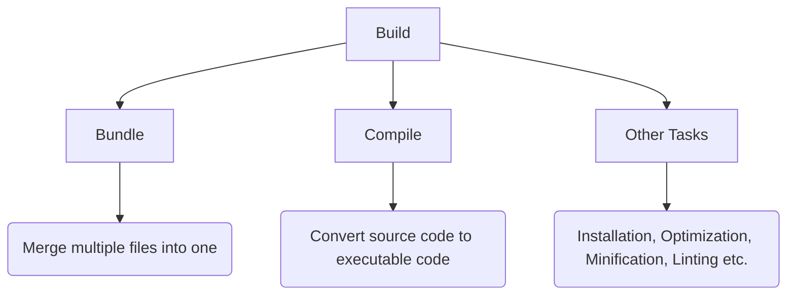
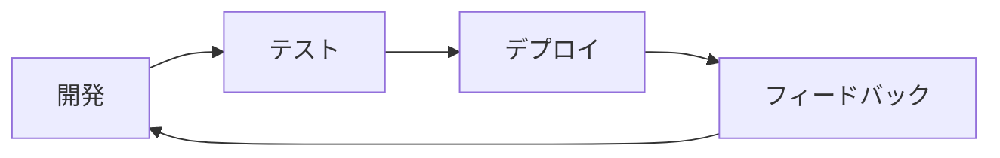
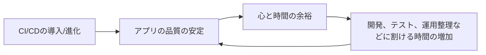
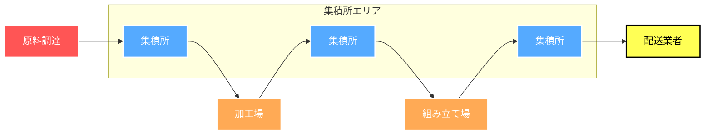
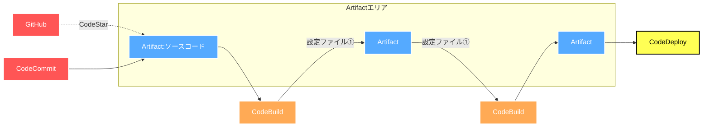
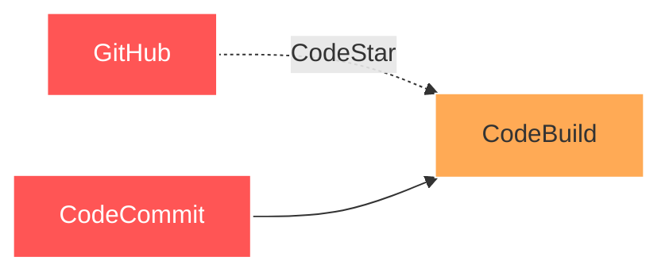

# 中村勉強会　 〜AWSインフラ編〜   Codeサービス系 
# #2 組み立て工場見学!ざっくりとパイプラインを外観する

---
transition: fade-out
---

# この勉強会の目標

 
<h2>・CodePipelineがどのようにしてCI/CDフローを形成するかを理解する</h2>
 
<h2>・CodePipelineの主要概念を理解する</h2>
 
<h2>・マネコン/CDKでの実装方法を理解する</h2>

---
transition: fade-out
---

# 本日のお題目

## 0. 軽く前回のおさらい
 

## 1. CodePipelineの役割
 

## 2. 工場見学①原料調達
 

## 3. 工場見学②加工場
 

## 4. CodePipelineの主要概念
---
transition: fade-out
layout: center
class: text-center
---

<h1>0.前回のおさらい</h1>

---
transition: fade-out
---

# CI/CDとは？

 

## ①CI(Continuous Integration)
→ コードの変更を継続的に統合する過程(ビルド、テスト)

 

## ②CD(Continuous Deployment/Delivery)
→ 統合されたコードを実環境に継続的に反映させる過程(デプロイ)

---
transition: fade-out
---

# 高速なフィードバックループの実現

 

## ①アプリケーションの品質安定

 

## ②手動運用時に起こりうるヒューマンエラーの削減

### だけではなく...

---
transition: fade-out
---

# もう一つの幸せスパイラル

 

---
transition: fade-out
---

# 実はCI/CDツールはたくさんある
## →CircleCI,Jenkins,GitLab,GitHub Actions, Azure,GCP系サービス

## 結論:AWSのサービス群を選択

 

## 1.信頼と実績

### ・すでにプロトが用意してあって、最低限のCI構築はできていた
### ・CodeDeployだけ一応使ったことがあった
 

## 2.応用可能性/親和性

### ・その他インフラリソースとの親和性

### ・IaCサービス(AWS Cloud Development Kit)との親和性

## 3.学習コスト
### ・学習コストのことだけ考えれば、基本的にサードパーティ製のツールはない方がいい

---
transition: fade-out
---

# AWSのCode系サービス
1. CodePipeline...パイプライン(流れ)を定義
2. CodeCommit/Artifact...GitHubのAWS版、ソースストレージ
3. CodeBuild...ビルドのための環境を素早く用意、ビルドプロセスの構築
4. CodeDeploy...デプロイ

____
よりマネージドなCI/CDサービス

5. CodeGuru...リッチでニッチな使い道(機械学習使ったコードレビュー)
6. CodeStar...CI/CDめっちゃマネージド(テンプレから選べる)
7. CodeCatalyst...メンバーオンボーディング、IDE連携、CodeStar+CDK構築まで一気通貫(マネージドの鬼)、コツを掴めば、爆速開発環境、インフラ、パイプライン構築可能かも

---
transition: fade-out
layout: center
class: text-center
---

<h1 style="fontsize: 50px;">1.CodePipelineの役割</h1> 

---
transition: fade-out
---
## ある機械製品が出来上がるまでの流れ

 

---
transition: fade-out
---

# 原料調達

 

 

## ①接続先の設定

 

## ②外部プロバイダーを挟む場合、一工夫必要(GitHubとの連携にはCodeStarが簡単)

   

   
   

---
transition: fade-out
---

# CodeStar Connectionsを利用してGitHubと接続する

   

   
   

   

   ## ①Sourceステージでトリガー先の設定をする

    
   
   ## ②CodeStar Connectionsで取得した接続ARN(後述)を入力

    

   ## ③トリガー先リポジトリ、ブランチを選択

   

---
transition: fade-out
---

# CodeStar Connectionsの接続を作成する

   

   ### ①接続の作成

   
   

   

   ### ②GitHubを選択し、接続名を入力
   
   

---
transition: fade-out
---

# 使用する認証アプリの設定

   

   ### ③どのアカウントにインストールされたアプリを使うか選択

   
   

   

   ### ④新しいアプリをインストールを選択すると設定にいける
   
   

---
transition: fade-out
---

# 設定確認

   

   ### ⑤パスワード入力

   
   

   

   ### ⑥ インストールアプリの設定変更
   

   

---
transition: fade-out
---

# 対象リポジトリの追加とARNの確認

   

   ### ⑤対象リポジトリの追加

   
   

   

   ### ⑥ ARN確認
   

   

---
transition: fade-out
---

# まとめ

## ・AWSのCodeなんちゃらサービスはたくさんある

 

## ・CI/CDというか、運用構築は早めに取り組んだ方がいい
 

## ・Codeなんちゃらは整理すれば意外と分かりやすい

 

## ・次回はCodePipeline、CodeBuildをやりたい

---
transition: fade-out
---

## ①CI(Continuous Integration)
→ コードの変更を継続的に統合する過程(ビルド、テスト)

 

## ②CD(Continuous Deployment/Delivery)
→ 統合されたコードを実環境に継続的に反映させる過程(デプロイ)

---
transition: fade-out
---

# 0.前回のおさらい

## 高速なフィードバックループの実現

 

## ①アプリケーションの品質安定

 

## ②手動運用時に起こりうるヒューマンエラーの削減

### だけではなく...

---
transition: fade-out
---

# 0.前回のおさらい

## もう一つの幸せスパイラルを生む

 

---
transition: fade-out
---

# 0.前回のおさらい

## 実はCI/CDツールはたくさんある
## →CircleCI,Jenkins,GitLab,GitHub Actions, Azure,GCP系サービス

## 結論:AWSのサービス群を選択

 

## 1.信頼と実績

### ・すでにプロトが用意してあって、最低限のCI構築はできていた
### ・CodeDeployだけ一応使ったことがあった
 

## 2.応用可能性/親和性

### ・その他インフラリソースとの親和性

### ・IaCサービス(AWS Cloud Development Kit)との親和性

## 3.学習コスト
### ・学習コストのことだけ考えれば、基本的にサードパーティ製のツールはない方がいい

---
transition: fade-out
---

# 0.前回のおさらい
1. CodePipeline...パイプライン(流れ)を定義
2. CodeCommit/Artifact...GitHubのAWS版、ソースストレージ
3. CodeBuild...ビルドのための環境を素早く用意、ビルドプロセスの構築
4. CodeDeploy...デプロイ

____
よりマネージドなCI/CDサービス

5. CodeGuru...リッチでニッチな使い道(機械学習使ったコードレビュー)
6. CodeStar...CI/CDめっちゃマネージド(テンプレから選べる)
7. CodeCatalyst...メンバーオンボーディング、IDE連携、CodeStar+CDK構築まで一気通貫(マネージドの鬼)、コツを掴めば、爆速開発環境、インフラ、パイプライン構築可能かも

---
transition: fade-out
---

# 3.CI/CDに関わるCode〇〇サービス

改めて整理する(していただく)と

引用元:https://pages.awscloud.com/rs/112-TZM-766/images/20210126_BlackBelt_CodeDeploy.pdf

---
transition: fade-out
---

# まとめ
