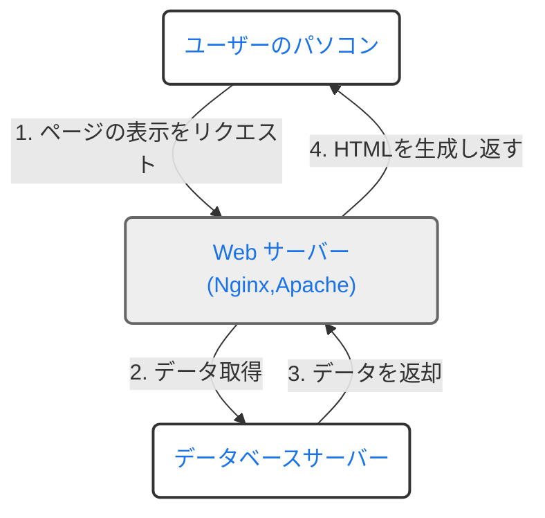
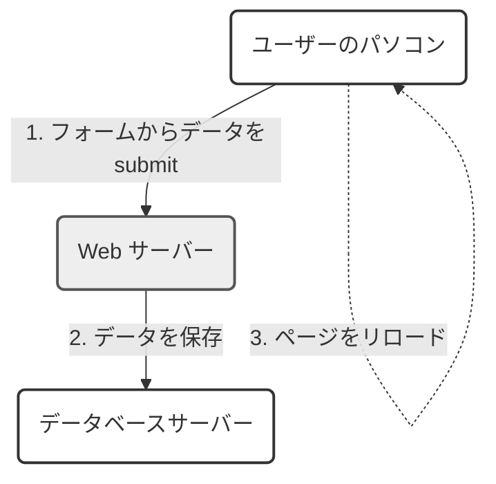

# 〜我々になぜRemix💽が<br>必要なのか Part1〜
## 中村友多朗

---
transition: fade-out
---
<h1 class="section-title">この勉強会の目標</h1>
<h3>以下を理解したい</h3>
<br>

<h2>・Webフロントエンドの簡単な変遷とSPAが抱えてきた課題</h2>
<br>
<h2>・PESPAアーキテクチャの観点から見たRemix💽の優れた思想</h2>
<br>
<h2>・Remix💽の将来性</h2>

---
transition: fade-out
---
<h1 class="section-title">本日(と多分次回)のお題目</h1>

<style scoped>
h2 {
  margin-bottom: 20px; /* タイトル間のスペースを調整 */
}
ul {
  margin-top: 20px; /* リストの上のスペースを調整 */
}
</style>

<h2 >1. Webにおける通信技術とReact周りの簡単な歴史</h2>
<h2 >2. SPAの登場とそれがもたらした新たな課題</h2>
<h2 >3.プログレッシブエンハンスメントという思想とRemix💽</h2>
<h2 >
4. DjangoとRemix💽の違い

</h2>

- アーキテクチャ
- ルーティング

<h2 >5.なぜNext.jsではなくRemixを選ぶのか</h2>
<h2 >6.Remix💽の将来性</h2>


---
transition: fade-out
layout: center
---

## 1.Webにおける通信技術とフロントエンド周りの簡単な歴史


---
transition: fade-out
layout: two-cols-header
---

<h2 class="normal-section-title">Webにおける動的なアプリケーションの起源</h2>


::left::

## CGI(Common Gateway Interface)方式
<br>
<ul>
<li v-click>Webサーバーが別の言語に処理を委譲して動的にHTMLを生成する仕組み</li>
<li v-click>ページ表示のリクエストに対して、データベースに保存されているデータを動的に埋め込んだHTMLをレスポンスとして返却</li>
<li v-click>紆余曲折あり、これをwebサーバー側でなくwebサーバーと接続して、Python等のアプリケーション側でやろうという仕組みの一つが、WSGI(ウィスキー)で、それを実現するアプリケーションがuWSGI</li>
</ul>

::right::
<br>



---
transition: fade-out
layout: two-cols-header
---

<h2 class="normal-section-title">ユーザー操作のデータ反映をどのように画面に対して行ったか</h2>


::left::

##
<br>
<ul>
<li v-click>JSによる通信が出てくる前はHTMLのform要素のsubmit処理を用いて、ユーザー入力データをサーバーへ送信(もちろん今でも使う)</li>
<li v-click>送信後、ページがリロードされ入力データが画面に反映される(デフォルトの挙動)</li>
<li v-click>毎度クライアントサイドの状態はリセットされる</li>

</ul>

::right::

<br>




---
transition: fade-out
---

<h2 class="normal-section-title">非同期処理の登場とJSにおけるインタラクティブUIの盛り上がり</h2>


<ul>
<li v-click>1998年:MicrosoftがXMLhttpRequest(XHR)という非同期通信のためのオブジェクトを開発し、IE5で利用可能に</li>
<li v-click>2005年:GoogleMapショック、「Ajax」(Asynchronous JavaScript and XML*1)がJesse James Garrettによって提唱*2される</li>
<li v-click>2006年8月:jQueryがリリース。当時はJSの標準化があまり進んでおらず、ブラウザ間で生じていた違いを吸収する役割を担い、一時代を築く</li>
<li v-click style="margin-bottom:80px">2007年6月:Apple製スマートフォン「iPhone」発売とFlashの衰退</li>

</ul>

<br>
<span v-click>
*1:XMLという名前が付いているのは、当時Ajaxが採用していたデータ交換フォーマットがXML形式だったことに由来。今はJSON形式。

<br>
*2:https://courses.cs.washington.edu/courses/cse490h/07sp/readings/ajax_adaptive_path.pdf
</span>

---
transition: fade-out
layout: two-cols-header
---

<h2 class="normal-section-title">Ajaxという武器を得たMPA(PEMPAアーキテクチャ)</h2>


::left::

```html
<body>
    <h1>Update Data</h1>
    <form id="dataForm">
        <input type="text" id="dataInput" placeholder="Enter some data">
        <button type="submit">Update</button>
    </form>
    <div id="responseArea">Response will appear here.</div>

    <script>
        $(document).ready(function() {
            $('#dataForm').submit(function(event) {
                event.preventDefault(); // フォームのデフォルト送信動作を防止
                let inputData = $('#dataInput').val(); // 入力データを取得

                $.ajax({
                    url: '/update-data/', // DjangoのビューのURL
                    method: 'POST',
                    data: {data: inputData},
                    success: function(response) {
                        $('#responseArea').text('Response: ' + response.newData);
                    },
                    error: function() {
                        $('#responseArea').text('Error occurred.');
                    }
                });
            });
        });
    </script>
</body>
</html>

```


::right::
<div style="margin-left: 30px;">

出典: <a href="https://www.epicweb.dev/the-webs-next-transition">The Web’s Next Transition(PEMPA)</a>

<p>・デフォルトのsubmit動作を中断し、Ajaxによる非同期リクエスト、その結果をもとにテンプレートのDOMを直接変更</p>
<p>・従来のシンプルなクライアントサーバの関係を尊重しつつ、インタラクティブなUIを実現しようとする構成</p>
<p>・手軽だが、スケールすると辛くなる</p>
<p>・</p>


</div>

---
transition: fade-out
layout: center
---

## 2. SPAの登場とそれがもたらした新たな課題

---
transition: fade-out
layout: two-cols
---


<h2 class="normal-section-title">SPA(Single Page Application)</h2>

<ul>
<li v-click>その名の通り、一枚のHTMLで構成されたアプリケーションのこと</li>
<li v-click>先ほどから挙げている非同期通信を利用してJSで動的に画面の変更をおこなったり、また従来サーバーサイドが担ってきたルーティングロジックを担ったりと、クライアントサイドでの責務が多めのアーキテクチャ</li>
<br>
<li v-click>2010年後半:knockout, Backbone.js, AngularJS</li>
<li v-click>2013年5月:Reactが一般公開</li>
<li v-click>2014年:Vue.jsがリリース</li>


</ul>

::right::


<div style="margin-left: 30px;">

出典: <a href="https://www.epicweb.dev/the-webs-next-transition">The Web’s Next Transition(SPA)</a>


</div>

---
transition: fade-out
---

<h2 class="normal-section-title">なぜSPAが求められてきたのか</h2>


<h3 v-click>1.2000年後半からのWebでリッチなUIを作ろうとする盛り上がり</h3>
<br>
<h3 v-click style="color:red">2.クロスプラットフォーム対応の必要性から生じた、バックエンドがAPIとして分離されたアーキテクチャへの需要</h3>

<h3 v-click>
→例えばある通販サイト(webアプリケーション)をMPAのアーキテクチャで構築したとする.通販サイトには利用者側の画面、管理者側の画面が存在したときに、利用者側の画面は後々、ビジネス上の要求からモバイルアプリケーションとして構築することが必要になるかもしれない.この時仮にMPAアーキテクチャを採用していた場合、そのwebアプリ用コードと同一のロジックをネイティブアプリ側に実装する必要が出てくる.もしそれをSPAアプリケーションとして実装していたら、重複するのはUIの部分のみで、新たなモバイルアプリケーションでも、事前に実装したバックエンドAPIが使える
</h3>
