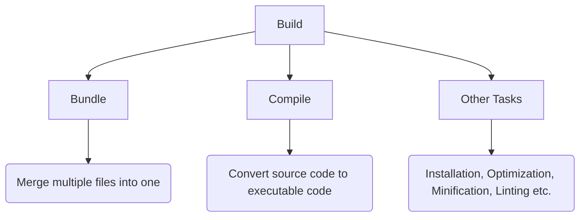
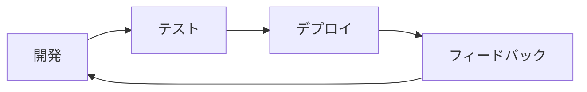
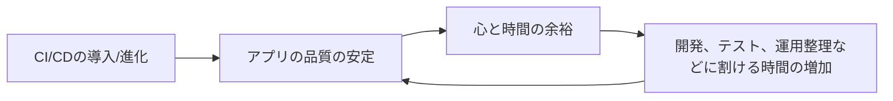

# 中村勉強会　 〜AWSインフラ編〜   Codeサービス系 
# #2 組み立て工場見学!ざっくりとパイプライン、ビルド、デプロイの中を覗く

---
transition: fade-out
---

# この勉強会の目標

 
<h2>・CodePipeline,Build,Deploy,Artifactがどのような役割を担うかを理解する</h2>
 
<h2>・CodeBuildとDeployに関して、それぞれに必要な設定ファイルの種類と中身をざっくり理解する</h2>
 
<h2>・マネコン/CDKでの実装方法をふわっと理解する</h2>

---
transition: fade-out
---

# 本日のお題目

## 0. 軽く前回のおさらい
 

## 1. CodePipeline
 

## 2. CodeBuild/CodeArtifact
 

## 3. CodeDeploy
---
transition: fade-out
---

# 0.前回のおさらい

## CI/CDとは？

 

## ①CI(Continuous Integration)
→ コードの変更を継続的に統合する過程(ビルド、テスト)

 

## ②CD(Continuous Deployment/Delivery)
→ 統合されたコードを実環境に継続的に反映させる過程(デプロイ)

---
transition: fade-out
---

# 0.前回のおさらい

## 高速なフィードバックループの実現

 

## ①アプリケーションの品質安定

 

## ②手動運用時に起こりうるヒューマンエラーの削減

### だけではなく...

---
transition: fade-out
---

# 0.前回のおさらい

## もう一つの幸せスパイラルを生む

 

---
transition: fade-out
---

# 0.前回のおさらい

## 実はCI/CDツールはたくさんある
## →CircleCI,Jenkins,GitLab,GitHub Actions, Azure,GCP系サービス

## 結論:AWSのサービス群を選択

 

## 1.信頼と実績

### ・すでにプロトが用意してあって、最低限のCI構築はできていた
### ・CodeDeployだけ一応使ったことがあった
 

## 2.応用可能性/親和性

### ・その他インフラリソースとの親和性

### ・IaCサービス(AWS Cloud Development Kit)との親和性

## 3.学習コスト
### ・学習コストのことだけ考えれば、基本的にサードパーティ製のツールはない方がいい

---
transition: fade-out
---

# 0.前回のおさらい
1. CodePipeline...パイプライン(流れ)を定義
2. CodeCommit/Artifact...GitHubのAWS版、ソースストレージ
3. CodeBuild...ビルドのための環境を素早く用意、ビルドプロセスの構築
4. CodeDeploy...デプロイ

____
よりマネージドなCI/CDサービス

5. CodeGuru...リッチでニッチな使い道(機械学習使ったコードレビュー)
6. CodeStar...CI/CDめっちゃマネージド(テンプレから選べる)
7. CodeCatalyst...メンバーオンボーディング、IDE連携、CodeStar+CDK構築まで一気通貫(マネージドの鬼)、コツを掴めば、爆速開発環境、インフラ、パイプライン構築可能かも

---
transition: fade-out
---

# 1.CodePipeline/CodeCommit

## ある機械製品が出来上がるまでの流れ

 

 

<h2 v-click>CodePipelineはこの一連のプロセス設計を担う</h2>

---
transition: fade-out
---

# 1.CI/CDの重要性

## 高速なフィードバックループの実現

 

## ①アプリケーションの品質安定

 

## ②手動運用時に起こりうるヒューマンエラーの削減

### だけではなく...

---
transition: fade-out
---

# 1.CI/CDの重要性

## もう一つの幸せスパイラルを生む

 

---
transition: fade-out
---

# 2.実現手段と選定理由

## 実はCI/CDツールはたくさんある
## →CircleCI,Jenkins,GitLab,GitHub Actions, Azure,GCP系サービス

## 結論:AWSのサービス群を選択

 

## 1.信頼と実績

### ・すでにプロトが用意してあって、最低限のCI構築はできていた
### ・CodeDeployだけ一応使ったことがあった
 

## 2.応用可能性/親和性

### ・その他インフラリソースとの親和性

### ・IaCサービス(AWS Cloud Development Kit)との親和性

## 3.学習コスト
### ・学習コストのことだけ考えれば、基本的にサードパーティ製のツールはない方がいい

---
transition: fade-out
---

# 3.CI/CDに関わるCode〇〇サービス
1. CodePipeline...パイプライン(流れ)を定義
2. CodeCommit/Artifact...GitHubのAWS版、ソースストレージ
3. CodeBuild...ビルドのための環境を素早く用意、ビルドプロセスの構築
4. CodeDeploy...デプロイ

____
よりマネージドなCI/CDサービス

5. CodeGuru...リッチでニッチな使い道(機械学習使ったコードレビュー)
6. CodeStar...CI/CDめっちゃマネージド(テンプレから選べる)
7. CodeCatalyst...メンバーオンボーディング、IDE連携、CodeStar+CDK構築まで一気通貫(マネージドの鬼)、コツを掴めば、爆速開発環境、インフラ、パイプライン構築可能かも

---
transition: fade-out
---

# 3.CI/CDに関わるCode〇〇サービス

改めて整理する(していただく)と

引用元:https://pages.awscloud.com/rs/112-TZM-766/images/20210126_BlackBelt_CodeDeploy.pdf

---
transition: fade-out
---

# まとめ

## ・AWSのCodeなんちゃらサービスはたくさんある

 

## ・CI/CDというか、運用構築は早めに取り組んだ方がいい
 

## ・Codeなんちゃらは整理すれば意外と分かりやすい

 

## ・次回はCodePipeline、CodeBuildをやりたい

---
transition: fade-out
---

## ①CI(Continuous Integration)
→ コードの変更を継続的に統合する過程(ビルド、テスト)

 

## ②CD(Continuous Deployment/Delivery)
→ 統合されたコードを実環境に継続的に反映させる過程(デプロイ)

---
transition: fade-out
---

# 0.前回のおさらい

## 高速なフィードバックループの実現

 

## ①アプリケーションの品質安定

 

## ②手動運用時に起こりうるヒューマンエラーの削減

### だけではなく...

---
transition: fade-out
---

# 0.前回のおさらい

## もう一つの幸せスパイラルを生む

 

---
transition: fade-out
---

# 0.前回のおさらい

## 実はCI/CDツールはたくさんある
## →CircleCI,Jenkins,GitLab,GitHub Actions, Azure,GCP系サービス

## 結論:AWSのサービス群を選択

 

## 1.信頼と実績

### ・すでにプロトが用意してあって、最低限のCI構築はできていた
### ・CodeDeployだけ一応使ったことがあった
 

## 2.応用可能性/親和性

### ・その他インフラリソースとの親和性

### ・IaCサービス(AWS Cloud Development Kit)との親和性

## 3.学習コスト
### ・学習コストのことだけ考えれば、基本的にサードパーティ製のツールはない方がいい

---
transition: fade-out
---

# 0.前回のおさらい
1. CodePipeline...パイプライン(流れ)を定義
2. CodeCommit/Artifact...GitHubのAWS版、ソースストレージ
3. CodeBuild...ビルドのための環境を素早く用意、ビルドプロセスの構築
4. CodeDeploy...デプロイ

____
よりマネージドなCI/CDサービス

5. CodeGuru...リッチでニッチな使い道(機械学習使ったコードレビュー)
6. CodeStar...CI/CDめっちゃマネージド(テンプレから選べる)
7. CodeCatalyst...メンバーオンボーディング、IDE連携、CodeStar+CDK構築まで一気通貫(マネージドの鬼)、コツを掴めば、爆速開発環境、インフラ、パイプライン構築可能かも

---
transition: fade-out
---

# 3.CI/CDに関わるCode〇〇サービス

改めて整理する(していただく)と

引用元:https://pages.awscloud.com/rs/112-TZM-766/images/20210126_BlackBelt_CodeDeploy.pdf

---
transition: fade-out
---

# まとめ
